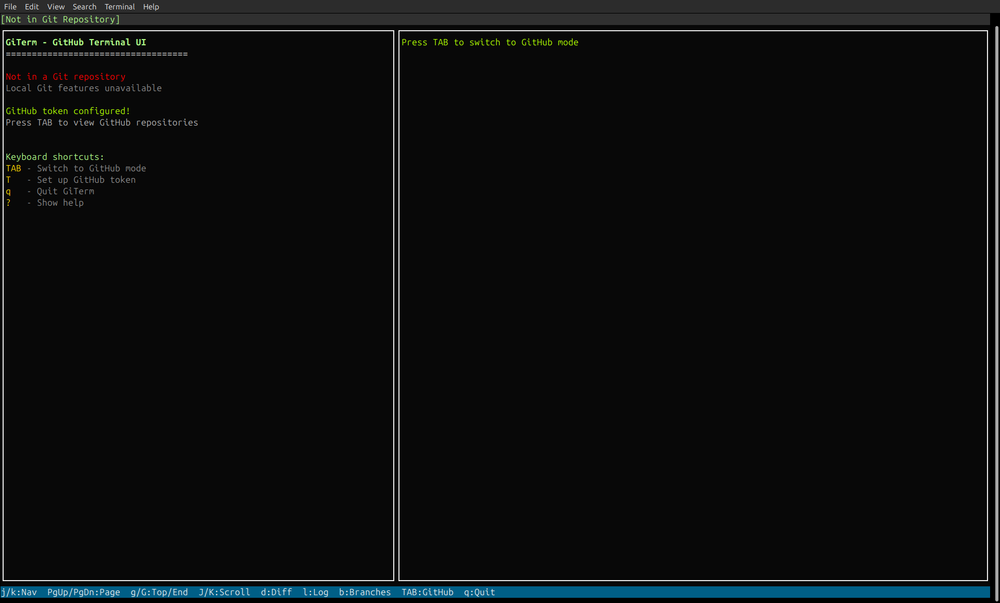

# GiTerm - Git & GitHub Terminal User Interface

[](https://unlicense.org/)
[](https://github.com/isene/GiTerm/stargazers)
[](https://isene.org)

 [](https://badge.fury.io/rb/giterm) 

A powerful Git and GitHub Terminal User Interface (TUI) client written in Ruby using rcurses. Browse repositories, manage issues and pull requests, and perform Git operations - all from your terminal.

## Key Features

### 🔧 Git Operations
- **Status View** (`s`) - View git status with colored file indicators
- **Diff View** (`d`) - Show file diffs with syntax highlighting  
- **Log View** (`l`) - Browse commit history with details
- **Branch Management** (`b`) - List, switch, and manage branches
- **Stage/Unstage** (`a`/`u`) - Stage or unstage files
- **Commit** (`c`) - Commit changes with message editor
- **Push/Pull** (`p`/`P`) - Sync with remote repositories
- **Repository Switching** (`:cd`) - Change to different git repositories

### 🌐 GitHub Integration  
- **Repository Browser** (`TAB`) - Browse all your GitHub repositories with:
  - Color-coded organizations for visual distinction
  - Star/fork/issue counts
  - Language indicators
  - README preview with delayed fetching
  - File tree exploration
- **Issues** (`i`) - View repository issues
- **Pull Requests** (`p` in GitHub mode) - View pull requests
- **Search** (`/`) - Search across repositories
- Automatic repository detection from git remote

### 🎯 Enhanced Navigation
- **List Navigation**
  - `j`/`k` or `↓`/`↑` - Move up/down
  - `PgUp`/`PgDn` - Page up/down
  - `g`/`G` or `HOME`/`END` - Jump to top/bottom
  - Smooth wrapping at list boundaries

- **Right Pane Scrolling**
  - `Shift-↓`/`Shift-↑` - Line down/up
  - `Shift-→`/`Shift-←` - Page down/up
  
- **General**
  - `TAB` - Toggle between Git/GitHub modes
  - `h`/`←` - Go back/up one level
  - `l`/`→` or `ENTER` - Enter/view details
  - `?` - Show context-sensitive help
  - `r` - Refresh current view
  - `q` - Quit

### Command Mode
- `:` - Enter git command mode
- `!` - Enter shell command mode

## Screenshots

### Git Repository Status View
Shows the enhanced status view with file changes and detailed diff information in the right pane:


### Non-Git Directory Support
New in v1.1.0 - GiTerm now runs in non-git directories and offers GitHub integration:



### GitHub Repositories Mode
Browse all your GitHub repositories with detailed information and README preview:


### Help System
Comprehensive help showing all available keyboard shortcuts:


## Requirements

- Ruby 2.7 or higher
- rcurses gem (will be installed automatically)
- Git installed and configured
- GitHub personal access token (for GitHub features)

## Installation

### Via RubyGems (Recommended)
```bash
gem install giterm
```

### Manual Installation
```bash
# Clone the repository
git clone https://github.com/isene/GiTerm.git
cd GiTerm

# Make executable
chmod +x giterm

# Install dependencies
gem install rcurses
```

## Usage

Run GiTerm from within any Git repository:

```bash
giterm
```

Or if installed manually:
```bash
./giterm
```

### Interface Layout

The interface consists of four panes:
- **Top Pane**: Current repository, branch, and mode indicator
- **Left Pane**: List view (files, branches, repos, etc.)
- **Right Pane**: Detail view with scrollable content
- **Bottom Pane**: Command input and status messages

### Performance Features
- **Smart Fetching**: Extended content (README, file lists) fetches after 0.5s pause
- **Efficient Updates**: Only changed content is redrawn
- **Mode Memory**: Remembers your position when switching between modes

## Configuration

### GitHub Token Setup

To enable GitHub features, set up a personal access token:

1. Create a token at: https://github.com/settings/tokens
2. Required scopes: `repo`, `read:user`
3. Set the environment variable:

```bash
# Add to your shell profile (.bashrc, .zshrc, etc.)
export GITHUB_TOKEN=ghp_your_token_here
```

### Custom Configuration

GiTerm looks for configuration in the following order:
1. Environment variable `GITHUB_TOKEN`
2. Git config: `git config --global giterm.token YOUR_TOKEN`

### Additional Commands

**Command Mode** (`:`):
- `:cd /path/to/repo` - Change to a different git repository
- Any git command - Executes in current repository

**Shell Mode** (`!`):
- Execute any shell command from within GiTerm

## What's New

### Version 1.1.0
- 🏠 **Non-Git Directory Support** - GiTerm now runs outside git repositories!
- 📊 **Enhanced Local Repository Info** - Rich repository overview when working tree is clean
- 🔧 **Smart Mode Switching** - Seamless switching between local Git and GitHub modes
- 🎯 **Improved User Experience** - Better error handling and helpful guidance
- 📸 **Updated Documentation** - New screenshots showing all major features

### Version 1.0.0
- 🎨 Organization color coding in GitHub mode
- 📜 Right pane scrolling with Shift+Arrow keys
- ⚡ Smart delayed fetching for smooth navigation
- 🔄 Mode-specific index memory
- 📁 Repository switching with `:cd` command
- 🐛 Fixed display issues and improved performance

## Design Philosophy

GiTerm follows these principles:
- **Single file implementation** - Easy to understand and modify
- **Minimal dependencies** - Only requires rcurses
- **Fast and responsive** - Optimized rendering and smart fetching
- **Keyboard-driven** - No mouse required
- **Clean Ruby code** - RuboCop compliant and well-documented

## Contributing

Contributions are welcome! Please:
1. Fork the repository
2. Create your feature branch
3. Run RuboCop to ensure code style
4. Submit a pull request

## Author

Created by Geir Isene ([@isene](https://github.com/isene))

## License

Public Domain - Use freely for any purpose.

## See Also

- [RTFM](https://github.com/isene/RTFM) - Ruby Terminal File Manager
- [rcurses](https://github.com/isene/rcurses) - Ruby curses library used by GiTerm
